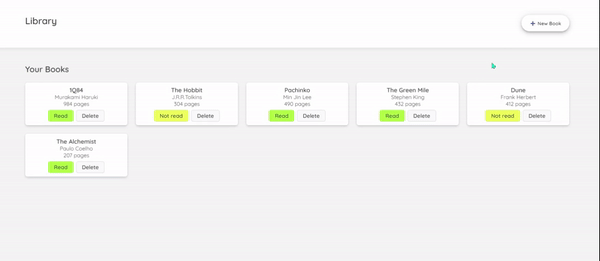

# Introduction
Small library app to keep track of information of your books in the local storage.

[👉Live Demo]()



This app features: 
- add or delete book
- keeps track of the book title, author, pages, whether or not you have read the book
- toggle whether or not you have read the book after adding books
# Skills used
- **JavaScript** objects and object constructors
- **JavaScript** ```JSON.stringify``` and ```JSON.parse```
- **HTML** modal
- **CSS**
# Lessons learned
- using modal
- DOM input checkbox
- Creating book card did not function as expected at first. This was caused due to using wrong ID name for DOM manipulation 
- Delete and Remove buttons on each book card did not function as expected. Resolved by adding event listeners inside ```CreateBookCard```
# Future plans
- [x] refactor code
- [x] update Readme
- [ ] handle keyboard input to close modal
- [ ] display library status of numbers of books read, not read, and a total number of books
- [ ] save data on Firebase & enable user authentication
